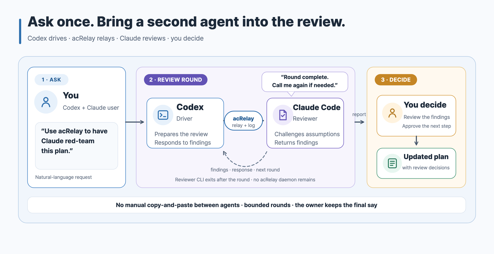
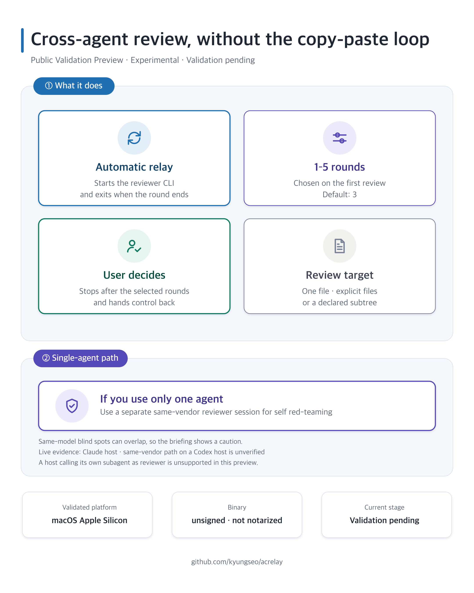
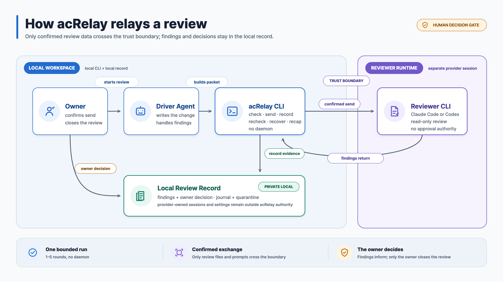

# acRelay

Agent Collaboration Relay for bounded cross-agent review.

**English** · [한국어](./README.ko.md)

Reviewing a plan or implementation with another coding agent can sharpen the
direction, uncover hidden defects, and raise the quality of the final result.
acRelay makes those review rounds easy to start whenever they are useful. The
agent doing the work asks a separate Claude Code or Codex CLI to review one
file or a defined set of files.

acRelay keeps the reviewed revision, findings, responses, and final owner
decision together in a record on your computer, outside shared or synced
folders.

The agent making the change is the **driver**. A person is the **owner**, makes
the final approval, and decides when the review is finished. acRelay organizes
and records the review; it does not make those decisions for the owner.

[](./skills/acrelay/assets/acrelay-review-flow.svg)

## Quick Start

On macOS, open Terminal and confirm that `uname -m` prints `arm64`. Then install
the exact engine and Skill for the host you use:

```sh
curl -fsSL https://raw.githubusercontent.com/kyungseo/acrelay/v0.1.0-alpha.5/scripts/install.sh |
  bash -s -- --skill-host codex
~/.local/bin/acrelay version
```

Use `claude` instead of `codex`, or `both`, with `--skill-host`. Start a fresh
Codex App, Codex CLI, or Claude Code session so the newly installed Skill is
discovered, then ask:

> Use acRelay to have Claude challenge this plan. Summarize the decisions I
> need to make at the end.

This preview accepts one file, explicit files, or a declared subtree as the
review target. It does not directly accept a PR URL, staged patch, commit
range, or branch comparison. To review a PR, check out the intended revision
first, then select its files or a declared subtree.

## Before You Start

This preview is for people who already work with Codex App, Codex CLI, or
Claude Code. A review runs through Claude Code CLI or Codex CLI, so at least
one of those reviewer CLIs must already be installed, signed in, and working.
Codex App can drive the work, but the reviewer still runs through a CLI.

Here, **App** means the desktop interface and **CLI** means a command that runs
in Terminal. The acRelay Skill and engine do not install or sign in to those
reviewer tools.

## Why acRelay

acRelay grew out of a working habit: after drafting a plan or implementation
in one tool, we asked the other to challenge it before the owner decided. The
reviews were useful. The handoff was the weak point.

For every round, someone had to copy the request to the reviewer and copy the
result back to the driver. Three rounds could mean six copy-and-paste handoffs,
while the user also had to remember which revision was reviewed and which
findings remained open.

| Manual relay | With acRelay |
| --- | --- |
| Copy each request and result between agents | Start the relay through the local binary or acRelay Skill |
| Track rounds, revisions, and findings by hand | Keep them together in one review record on your computer |
| Decide informally when the agents are done | Show a closeout summary and leave the final decision to the owner |

[](./docs/assets/social/acrelay-summary-cards.svg)

Each review objective is bounded to 1–5 formal rounds; the default is 3. The
limit prevents an open-ended argument and helps the user control reviewer
token and model costs. Long review loops also accumulate fatigue, repeated
prompts, and context drift that can push a reviewer toward approval without
adding useful scrutiny. At five rounds, the owner decides whether to close the
objective or deliberately start a new one.

The workflow is intentionally simple to use. Underneath, the engine keeps the
reviewed revision, findings, responses, recovery state, round limit, and owner
authority separate rather than treating a reviewer’s “looks good” as
completion.

## One Executable, No acRelay Daemon

acRelay is distributed as one executable. It does not run its own daemon,
server, database, queue, or background network service. For each formal round,
it starts a separately installed and authenticated Claude Code or Codex CLI,
checks the returned structure, records the result, and lets that reviewer
process exit.

The reviewer CLI may use its provider’s network and consume model tokens.
“Local record” means acRelay keeps its review history locally; it does not mean
the reviewer model runs locally.

## Choose A Driver And Reviewer

| How you work | Driver | Reviewer |
| --- | --- | --- |
| Drive from Codex App | Codex App | Claude Code CLI or Codex CLI |
| Drive from Claude Code | Claude Code CLI | Codex CLI or a separate Claude Code CLI session |
| Use only Claude Code | Claude Code CLI | A separate Claude Code CLI session |
| Use only Codex | Codex CLI | A separate Codex CLI session |

A different tool can challenge assumptions that the driver may not notice. If
you use only Codex or only Claude Code, you can still run a review through a
separate CLI session of the same tool, but the driver and reviewer may share
blind spots. This preview uses a CLI reviewer; it does not directly accept a
result produced by the driver tool's built-in subagent. The completed
same-vendor live evidence is a Claude Code host with a separate Claude Code
reviewer session; the same-vendor path on a Codex host remains unverified.

[](./docs/assets/acrelay-architecture-trust.svg)

## Public Validation Preview And Platform Expansion

`v0.1.0-alpha.5` is a **Public Validation Preview**. It is
**Experimental**, broader validation is still **Validation pending**, and it does not
claim general `Supported` status. The download and live-review evidence scope
is deliberately narrow:

- downloadable binary: **macOS Apple Silicon (`darwin/arm64`)** only
- reviewers: Claude Code CLI and Codex CLI, but only for combinations of
  reviewer version and operating system that were tested explicitly
- release: not Developer ID signed or notarized, version `v0.1.0-alpha.5`
- review model: one reviewer for each review, a fixed round limit, a recorded
  driver response to every finding, and a final decision by the owner

Windows is the next platform-support target. Its core runtime already passes
recorded test lanes; platform-specific Claude Code and Codex review validation
comes next, followed by any patches that evidence requires. Linux core runtime
CI remains part of the source test matrix, but this preview does not provide a
Linux artifact or live-review support. Until a combination is verified,
`v0.1.0-alpha.5` stops before sending a review. Intel Mac likewise has no
downloadable artifact or verified live-review combination in this release.

## Install

Install the exact `v0.1.0-alpha.5` preview. The installer never substitutes an
unpinned branch or a `latest` download.

### One-command engine and Skill install

On macOS, open Terminal and run `uname -m`. Continue with this prebuilt
installer only when the result is `arm64`.

The installer is pinned to the exact tag and verifies the downloaded binary
archive against the release checksum before executing it:

```sh
curl -fsSL https://raw.githubusercontent.com/kyungseo/acrelay/v0.1.0-alpha.5/scripts/install.sh |
  bash -s -- --skill-host codex
```

Choose `codex`, `claude`, or `both`. Omit `--skill-host` when you want the
engine only. The verified archive contains the exact-version official Skill as
well as the engine.

Piping a script to `bash` is convenient but does not let you inspect the
installer first. Use the review-first path below when you want to read it
before execution.

### Review-first binary install

The installer is pinned to one release and never resolves `latest`. Review it
before running:

```sh
curl -fLO https://raw.githubusercontent.com/kyungseo/acrelay/v0.1.0-alpha.5/scripts/install.sh
less install.sh
bash install.sh
```

It installs to `~/.local/bin` by default, does not use `sudo`, verifies the
release archive before executing its binary, and refuses to replace a
different engine or locally different Skill without `--replace`.

### Go install

```sh
go install github.com/kyungseo/acrelay/cmd/acrelay@v0.1.0-alpha.5
```

This source-install path requires the Go toolchain declared in
[`go.mod`](./go.mod). Go may download that toolchain according to the user’s
`GOTOOLCHAIN` configuration.

Verify either installation:

```sh
acrelay version
```

See [Installation and operations](./docs/OPERATIONS.md) for PATH setup,
updates, binary removal, macOS signing and Gatekeeper behavior, and recovery.

## Prefer Natural Language? Add The acRelay Skill

The engine is complete on its own, but most users should not need to remember
its low-level commands. This repository is the canonical source for both the
engine and the optional [acRelay Skill](./skills/acrelay). The Skill turns
requests such as “have Claude red-team this plan” into the same workflow. It
translates the request into acRelay steps; the engine checks the files, starts
the reviewer, and records the review. The Skill cannot run a review by itself,
so install both.

The Skill is part of the **Public Validation Preview**. It is
**Experimental**, its broader validation is still **Validation pending**, and
it does not claim general `Supported` status yet. The recommended installer
gets the engine and the exact bundled Skill from the same checksum-verified
release archive:

```sh
curl -fsSL https://raw.githubusercontent.com/kyungseo/acrelay/v0.1.0-alpha.5/scripts/install.sh |
  bash -s -- --skill-host both
```

Use `codex` or `claude` instead of `both` to install for one host. A matching
installation is idempotent. If an existing engine or Skill differs, the
installer preserves it and asks you to rerun with `--replace`; this protects
local Skill edits from silent overwrite.

To install the Skill manually or project-locally, copy the complete folder
from the exact tag:

```sh
git clone --depth 1 --branch v0.1.0-alpha.5 https://github.com/kyungseo/acrelay.git /tmp/acrelay-v0.1.0-alpha.5
```

Copy it to `$HOME/.claude/skills/acrelay`, `$HOME/.agents/skills/acrelay`, or
the matching project-local directory. Start a fresh agent session after a new
or updated Skill installation. See the
[Skill guide](./skills/acrelay/README.md) for exact manual commands, Windows
PowerShell Skill installation, updates, removal, and the current validation
boundary.

Example request:

> Use acRelay to have Claude challenge this plan. Summarize the decisions I
> need to make at the end.

If you do not specify a limit, acRelay allows up to three review rounds. You
may request any limit from one to five.

## Choose How Much The Reviewer May Read

acRelay makes review scope explicit instead of treating repository-wide search
or live web research as an invisible default:

- `contained` is the default. The reviewer receives only the declared subject.
- `contextual` adds an exact, revision-checked local context manifest. Context
  helps interpretation but remains non-authoritative.
- `research` also permits bounded reviewer web search and fetch for current
  factual verification. It requires a separate egress acknowledgment. The
  reviewer must report source URLs and retrieval dates; those declarations do
  not replace evidence from the review subject.

Command execution remains read-only and does not gain general network access.
If the combined subject and context exceed 8 members or 128 KiB, initialization
stops before dispatch until the user narrows the scope or explicitly accepts
the broader token, time, and context risk. Reviews request at most eight
actionable findings by default while never allowing critical or high findings
to be omitted.

## Direct CLI: First Review

Create a directory on your computer that is not shared, synced, or inside the
repository. The Markdown file that holds the official review history is the
**canonical record**:

```sh
mkdir -p "$HOME/.acrelay/reviews"
```

Start one review:

```sh
acrelay init \
  -canonical "$HOME/.acrelay/reviews/example.md" \
  -question "Is this change ready to ship?" \
  -target ./README.md \
  -approval-actor owner \
  -ack-vendor-egress \
  -execution-surface external-cli \
  -driver-vendor codex \
  -context-relation separate
```

The `-ack-vendor-egress` flag confirms that the selected reviewer service may
receive the files being reviewed, resolved file paths, and related metadata.
The review record stays local, but Claude Code or Codex may still send data to
its provider.

Run the first reviewer round:

```sh
acrelay review \
  -canonical "$HOME/.acrelay/reviews/example.md" \
  -reviewer claude \
  -prompt "Review the target against the objective. Return examined evidence and structured findings."
```

The driver then records whether each finding was accepted, revised, defended,
or needs the owner, together with a reason. `acrelay driver-response` accepts
one strict JSON file and commits the whole response atomically; one invalid
item leaves every finding unchanged. The owner answers any approval request
and runs the final `close` command. To see whether the review is ready to close
without changing anything, run:

```sh
acrelay briefing \
  -canonical "$HOME/.acrelay/reviews/example.md"
```

`briefing` only summarizes the current record. It is not approval and never
changes the review.

## What acRelay Records

- The exact files selected for review and a revision identifier that is checked
  again before important actions
- The excerpts the reviewer says it examined and its structured findings
- A recovery journal for interrupted reviewer runs; uncertain results are
  recorded as `UNKNOWN` and are not retried automatically
- The selected reviewer and the formal review-round limit
- The driver’s response and reason for every finding
- Owner approval requests and responses
- A read-only closeout summary that remains separate from the owner’s `close`
  command

These records do not prove that the reviewer understood everything or that its
review was complete, correct, or independent. They show only what acRelay
observed and what the driver, reviewer, or owner declared.

## Private State

The canonical record can contain reviewer output, prompts, file paths, and
execution details. Keep it private. This release cannot create a sanitized
copy for sharing.

`~/.acrelay` stores reviewer session identifiers and private working
directories used to continue a review. Removing the binary does **not** remove
them. Use `acrelay cleanup` with the exact canonical record and session
reference before removing retained acRelay state. acRelay cannot delete or
confirm deletion of session or configuration data owned by Claude Code, Codex,
or their providers.

## Documentation

- [Architecture and trust boundaries](./docs/ARCHITECTURE.md)
- [Behavioral and CLI reference](./docs/REFERENCE.md)
- [Installation, update, removal, and release recovery](./docs/OPERATIONS.md)
- [Release history](./CHANGELOG.md)
- [Natural-language acRelay Skill](./skills/acrelay/README.md)

The Skill is the easier front door; this repository is the authority for the
official Skill and for engine behavior, evidence, privacy, recovery, and
platform support.

## License

[Apache-2.0](./LICENSE). The software is provided without warranties or
conditions of any kind; see the license for the complete terms.
