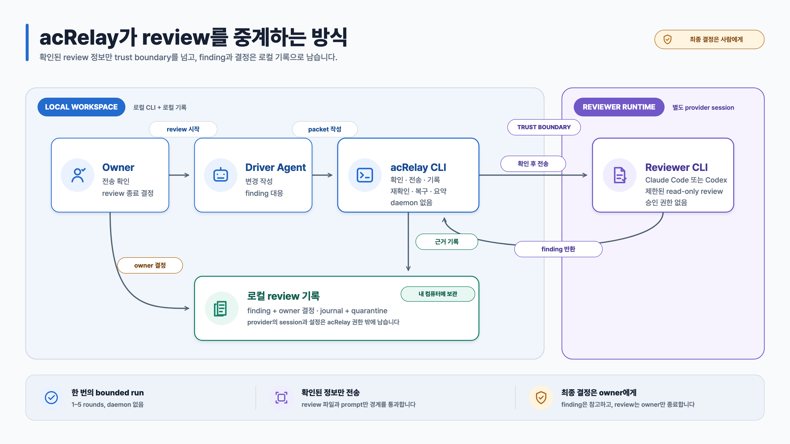

# acRelay 구조와 신뢰 경계

[English](./ARCHITECTURE.md) · **한국어**

acRelay는 정해진 검토 대상을 reviewer CLI에 보내고 결과를 기록하는 로컬
command-line tool입니다. Review 전체를 대신하지는 않습니다. Driver는 계속
변경을 작성하고 각 finding을 어떻게 처리할지 결정합니다. 사람인 owner도 계속
승인 요청과 review 종료를 결정합니다.



수정 가능한 source는
[`acrelay-architecture-trust.ko.svg`](./assets/acrelay-architecture-trust.ko.svg)입니다.

## 공간 구조

```text
review할 파일 ──읽기/확인──> acRelay ──승인된 data──> reviewer CLI
                                      │
                                      ├── 비공개 review 기록
                                      ├── 복구 journal/quarantine
                                      └── session ID + 비공개 작업 폴더

driver ──finding 처리──> review 기록 <──승인/종료── owner
```

도식은 다음 세 경계를 구분합니다.

1. **Review할 파일:** acRelay는 정확한 파일 목록을 기록하고 중요한 동작 전에
   다시 확인합니다. Reviewer에게 repository 전체를 변경할 권한을 주지 않습니다.
2. **사용자 컴퓨터의 비공개 기록:** canonical review 기록, 복구 journal,
   quarantine data, session 식별자와 working directory는 운영 데이터입니다.
   공유·동기화·publish하는 위치 밖에 보관합니다.
3. **Reviewer에게 보내는 데이터:** 선택한 reviewer service는 파일 내용, 해석된
   경로와 metadata를 처리할 수 있습니다. Owner의 확인은 이 전송을 허용할 뿐,
   reviewer를 로컬 또는 격리된 환경으로 만들지는 않습니다.

## Component별 역할

| Component | 하는 일 | 결정하지 않는 것 |
| --- | --- | --- |
| Kernel | Review와 governance 상태, round·attempt 제한을 추적 | Git hosting, merge, owner 판단 |
| Subject | 선택한 경로를 정규화하고 파일 목록과 revision을 기록 | Filesystem 전체의 atomic snapshot |
| Review | 확인한 발췌문, finding, driver 응답과 approval 기록을 저장 | 이해도나 정확성의 증명 |
| Relay | Reviewer 실행을 준비·전송·수집·복구 | 결과가 불확실한 실행의 자동 재시도 |
| Store | 비공개 canonical record를 읽고 원자적으로 교체 | 인증 또는 변조 방지 저장소 |
| Adapter | 검증된 reviewer version을 호출하고 session을 재개 | Reviewer 독립성 |
| Briefing | Review가 종료 가능한지 읽기 전용으로 요약 | 승인 또는 상태 변경 |
| Cleanup | 승인된 특정 acRelay session data만 제거 | Raw canonical 또는 vendor 소유 data 삭제 |

## Review 진행 순서

도식은 데이터가 어디에 있는지를 보여줍니다. Review는 다음 순서로 진행됩니다.

1. `init`이 review할 파일, 전송 정책, 선언한 reviewer 구성, owner와 시작
   revision을 기록합니다.
2. `review`가 요청한 reviewer를 실행할 수 있는지 확인합니다. 이 검사가
   실패해도 attempt는 사용되지 않습니다.
3. acRelay가 canonical record를 잠그고 파일을 다시 확인합니다. 첫 회차라면
   formal round 제한을 고정하고 복구 journal을 기록합니다.
4. Reviewer process가 시작됩니다. acRelay는 structured result를 수집해 해당
   회차를 canonical record에 추가합니다.
5. Driver가 모든 finding에 처리 결정과 이유를 기록합니다.
6. Owner가 approval request에 응답합니다.
7. `briefing`이 review를 변경하지 않고 종료 준비 상태를 요약합니다.
8. `close`가 파일과 종료 조건을 다시 확인한 뒤 owner의 종료 동작을 기록합니다.

Reviewer가 시작된 뒤 종료 결과를 확인할 수 없으면 복구 과정에서 `UNKNOWN`을
기록합니다. 해당 실행은 자동으로 다시 시도하지 않습니다.

## 실행 구성이 판단의 독립성을 보장하지는 않습니다

acRelay는 어떤 reviewer가 실행됐는지와 operator가 선언한 driver, 실행 환경,
두 context의 공유 여부를 기록합니다. 이 사실을 `cross-vendor-external` 같은
label로 요약할 수 있지만, 그 label이 “독립성 검증 완료”를 뜻하지는 않습니다.

Evidence에도 한계가 있습니다. Content-matched 발췌문은 인용문이 수집한 파일
byte와 일치한다는 사실만 확인합니다. Reviewer가 전체 변경을 이해했다는 뜻은
아닙니다.

## 현재 platform 경계와 지원 확대

처음 제공하는 downloadable binary는 `darwin/arm64` 전용입니다. 다음 platform
지원 대상은 Windows입니다. Windows CI는 core 동작을 이미 테스트하며,
platform별 Claude Code·Codex review 근거는 아직 검증 중입니다. Linux core
동작은 CI에서 계속 확인하지만, 이번 preview에는 Linux artifact와 live-review
지원 계획이 없습니다. 조합을 검증하기 전까지는 review 회차를 사용하기 전에
중단합니다. Intel Mac은 이번 release에서 배포 binary와 검증된 live-review
조합이 없습니다.

정확한 platform, restriction, journal, evidence와 cleanup 계약은
[동작 reference](./REFERENCE.ko.md)를 참고하세요.
