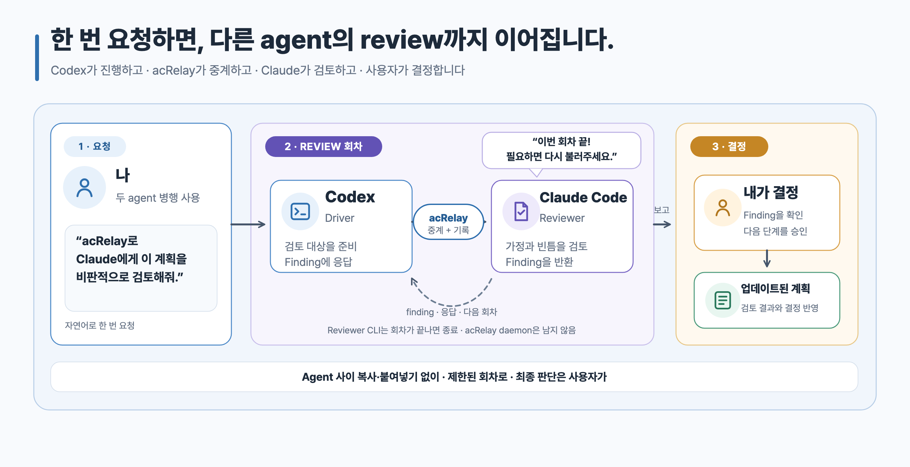

# acRelay Skill

[English](./README.md) · **한국어**

계획이나 구현 결과를 다른 코딩 에이전트에게 검토받으면 방향을 더 정교하게
다듬고, 작업자가 놓친 결함을 찾고, 결과물의 완성도를 높일 수 있습니다. 이 Skill은
이런 검토를 자연어로 쉽게 시작하도록 돕습니다.

이 문서에서는 지금 작업을 진행하는 에이전트를 **driver**, 별도로 검토하는 CLI를
**reviewer**, 최종 결정을 내리는 사용자를 **owner**라고 부릅니다.

이 공식 Skill은 독립 실행형
[acRelay engine](https://github.com/kyungseo/acrelay)과 함께 배포됩니다.
Engine은 실행 파일 하나이며, 별도의 acRelay 전용 daemon, server 또는 database를
사용하지 않습니다. Engine과 Skill package 전체를 설치한 뒤 계획, 문서, 파일
하나, 선택한 구현 파일 또는 지정한 directory tree를 검토해 달라고 요청하면
됩니다. Skill은 별도 기능을 만들거나 Engine을 우회하지 않고, Engine이 제공하는
기능을 그대로 사용합니다.

두 구성요소가 맡는 일은 다릅니다.

- **Skill:** 자연어 요청을 acRelay에게 전달합니다.
- **Engine:** 파일을 확인하고 별도의 Claude Code 또는 Codex CLI reviewer를
  시작해 결과를 기록합니다.

> [!IMPORTANT]
> Skill과 engine을 모두 설치해야 합니다. Skill만으로는 review를 실행할 수
> 없습니다.

[](./assets/acrelay-review-flow.ko.svg)

## 첫 검토 시작하기

1. Codex App, Codex CLI 또는 Claude Code를 사용 중인지 확인하고, reviewer로
   사용할 CLI가 이미 설치되어 로그인까지 완료됐는지 확인합니다.
2. [Engine과 Skill package 전체를 설치합니다](#engine과-skill-설치).
3. 새로 설치한 Skill을 찾을 수 있도록 에이전트의 새 세션을 시작합니다.
4. 검토할 파일이나 범위가 제한된 파일 묶음과 reviewer로 사용할 Claude Code 또는
   Codex를 지정해 검토를 요청합니다.
5. 요청을 받으면 검토 내용, 해석된 경로와 메타데이터를 선택한 reviewer
   서비스로 보내는 데 동의합니다.
6. 판정과 finding(발견 사항)을 확인합니다. Reviewer는 의견을 제시하고, 어떤 내용을
   변경할지와 검토를 Close할지는 owner가 결정합니다.

## 어떤 수작업을 줄이는가

수동으로 진행하면 매 회차마다 요청을 reviewer에게 복사하고 결과를 다시 driver에게
복사해야 합니다. 3회차면 최대 6번을 복사·붙여넣게 됩니다.

| 사용 전 | acRelay Skill 사용 |
| --- | --- |
| Agent 사이에서 매 요청과 결과를 전달 | 자연어로 시작하면 Skill이 engine 호출 |
| 검토한 revision과 남은 finding을 직접 기억 | Revision, finding과 응답을 사용자 컴퓨터의 기록 하나에 보관 |
| 누군가 동의할 때까지 대화가 이어짐 | 1–5회(기본 3회) 안에서 검토하고 owner에게 결정 반환 |

한 번 호출하면 범위가 정해진 review objective 하나를 시작하며, review 회차는
1–5회(기본 3회) 진행할 수 있습니다. acRelay는 호출할 때만 실행하며 백그라운드
service로 계속 동작하지 않습니다.

## 공개 상태

이 Skill은 **Public Validation Preview**에 포함됩니다. 아직 **Experimental**
단계이고 더 넓은 검증은 **Validation pending**이며, Claude Code나 Codex에
일반적인 `Supported` 상태를 표시하지 않습니다. 작성자가 두 reviewer 경로에서
실제 review를 완료했지만, acRelay가 일반적인 `Supported` 상태로 표시하기 전에
초대된 비작성자 검증이 더 필요합니다.

`Validation pending`은 package가 없다는 뜻이 아닙니다. 문서화된 preview를
평가할 수는 있지만 acRelay가 아직 일반적인 runtime 지원을 주장하지 않는다는
뜻입니다.

## 시작 전 준비

Codex App, Codex CLI 또는 Claude Code를 이미 사용하고 있어야 합니다. Review는
Claude Code CLI나 Codex CLI를 통해 실행하므로 둘 중 하나는 미리 설치하고
로그인해 정상 실행되는 상태여야 합니다. Codex App은 driver가 될 수 있지만
reviewer는 CLI에서 실행됩니다.

여기서 **App**은 데스크톱 화면, **CLI**는 Terminal에서 실행하는 command를
뜻합니다. Skill과 engine은 reviewer 도구를 대신 설치하거나 로그인하지 않습니다.

## Engine과 Skill 설치

Terminal에서 exact `v0.1.0-alpha.4` `acrelay` command를 바로 실행할 수 있어야
합니다(`PATH`에 있어야 합니다). 현재 미리 build해 제공하는 binary는 macOS Apple
Silicon(`darwin/arm64`)용입니다. Terminal에서 `uname -m`을 실행하고 결과가
`arm64`일 때만 이 installer를 사용하세요. Installer는 `latest`로 바꾸지
않습니다.

```sh
curl -fsSL https://raw.githubusercontent.com/kyungseo/acrelay/v0.1.0-alpha.4/scripts/install.sh |
  bash -s -- --skill-host codex
```

`--skill-host`에는 `codex` 대신 `claude` 또는 `both`를 선택할 수 있습니다.
Installer는 release에 고정돼 있으며 engine과 Skill이 함께 담긴 archive를 공개
checksum과 대조합니다. 로컬 Skill 내용이 다르면 `--replace`를 명시하지 않는 한
보존합니다. 실행 전에 installer 내용을 확인하거나 고정 version의 `go install`을
사용하려면
[acRelay 설치 안내](https://github.com/kyungseo/acrelay/blob/v0.1.0-alpha.4/docs/OPERATIONS.ko.md)를
따르세요.

다음 platform 지원 대상은 Windows입니다. Windows core runtime lane은 이미
검증했으며, 다음 단계에서 Claude Code·Codex review를 검증하고 필요한 patch를
반영합니다. Linux core runtime CI는 source test matrix에 유지하지만, 이번
preview에는 Linux artifact와 live-review 지원이 없습니다. 조합을 검증하기
전까지 engine은 파일을 보내기 전에 중단합니다.

## 수동 또는 project-local Skill 설치

Exact acRelay `v0.1.0-alpha.4` tag에서 설치하고, `SKILL.md`만 복사하지 말고
`skills/acrelay` 폴더 전체를 복사합니다.

```sh
git clone --depth 1 --branch v0.1.0-alpha.4 https://github.com/kyungseo/acrelay.git /tmp/acrelay-v0.1.0-alpha.4
```

### Claude Code

```sh
mkdir -p "$HOME/.claude/skills"
cp -R /tmp/acrelay-v0.1.0-alpha.4/skills/acrelay "$HOME/.claude/skills/"
```

### Codex

```sh
mkdir -p "$HOME/.agents/skills"
cp -R /tmp/acrelay-v0.1.0-alpha.4/skills/acrelay "$HOME/.agents/skills/"
```

### Windows PowerShell

Windows에서는 같은 exact tag를 임시 폴더에 clone합니다.

```powershell
$source = Join-Path ([System.IO.Path]::GetTempPath()) "acrelay-v0.1.0-alpha.4"
git clone --depth 1 --branch v0.1.0-alpha.4 https://github.com/kyungseo/acrelay.git $source
```

Claude Code에 설치하려면 다음 명령을 사용합니다.

```powershell
$claudeSkill = Join-Path $HOME ".claude/skills/acrelay"
New-Item -ItemType Directory -Force (Split-Path $claudeSkill) | Out-Null
Remove-Item -LiteralPath $claudeSkill -Recurse -Force -ErrorAction SilentlyContinue
Copy-Item -Recurse (Join-Path $source "skills/acrelay") $claudeSkill
```

Codex에 설치하려면 다음 명령을 사용합니다.

```powershell
$codexSkill = Join-Path $HOME ".agents/skills/acrelay"
New-Item -ItemType Directory -Force (Split-Path $codexSkill) | Out-Null
Remove-Item -LiteralPath $codexSkill -Recurse -Force -ErrorAction SilentlyContinue
Copy-Item -Recurse (Join-Path $source "skills/acrelay") $codexSkill
```

이 명령은 Skill만 설치합니다. Windows용 engine artifact나 live-review
지원을 주장하지 않습니다.

특정 repository에서만 사용할 때는 `.claude/skills/acrelay` 또는
`.agents/skills/acrelay`에 복사하세요. 새로 설치하거나 update한 뒤에는 현재
session cache에 의존하지 않도록 agent host의 새 session을 시작합니다.
Update할 때는 다른 exact tag의 폴더 전체로 교체하고, 제거할 때는 설치된
`acrelay` 폴더만 삭제하세요.

실행 중인 Skill 자체는 engine을 자동으로 설치하거나 update하지 않습니다.
Engine이 없거나 version이 다르면 이유를 설명하고 중단하며, acRelay를 우회해
reviewer를 직접 호출하지 않습니다.

## 요청 예시

### 계획에 반대 의견 받기

```text
acRelay로 Claude에게 이 계획을 비판적으로 검토해 달라고 해줘. 마지막에 내가 결정해야 할 내용만 정리해줘.
```

별도로 지정하지 않으면 최대 3회차로 진행합니다. 필요하면 1~5회 안에서 원하는
제한을 요청할 수 있습니다.

### 파일 하나 review

```text
acRelay로 Codex에게 이 파일을 검토하게 해줘. 확인한 근거와 발견한 문제를 정리해줘.
```

### 구현 결과 review

```text
acRelay로 현재 구현 결과가 승인된 계획과 맞는지 검토하고, 어긋난 점을 정리해줘.
```

acRelay v0.1.0-alpha.4는 파일 하나, 명시한 여러 파일 또는 지정한 subtree를
받습니다. PR URL, staged patch, commit range 또는 branch comparison을 직접
선택하는 기능은 아직 없습니다. 원하는 revision을 checkout한 뒤 파일이나 subtree를
지정하세요.

### Review access 선택

```text
acRelay research profile로 Claude에게 이 계획의 최신 외부 사실을 확인하게 해줘. Local context는 내가 지정한 파일로만 제한해줘.
```

`contained`가 기본값이고, `contextual`은 exact non-authoritative local context
manifest를 추가하며, `research`는 별도 egress 동의와 함께 bounded web
search/fetch도 허용합니다. Research는 최신 사실 확인이 필요할 때 쓰며 단지
internet이 있다는 이유로 기본 선택하지 않습니다. Subject와 context 합계가
8개 file 또는 128 KiB를 넘으면 Skill은 범위를 줄이거나 broad-scope 동의를 한
번에 묻고, 조용히 dispatch하지 않습니다.

### Claude Code나 Codex 중 하나만 사용할 때

```text
지금 Claude Code에서 작업 중이야. 별도의 Claude Code CLI를 reviewer로 사용해서 이 작업을 검토해줘.
```

같은 도구의 별도 CLI session을 reviewer로 둘 수 있습니다. Claude Code나 Codex
중 하나만 쓸 때 유용하지만, driver와 reviewer가 같은 맹점을 공유할 수 있습니다.
이 preview는 CLI session을 통해 review하며, driver 도구의 내장 subagent 결과를
직접 받지는 않습니다.

### Driver와 reviewer 선택

| 사용 방식 | Driver | Reviewer |
| --- | --- | --- |
| Codex App에서 작업 | Codex App | Claude Code CLI 또는 Codex CLI |
| Claude Code에서 작업 | Claude Code CLI | Codex CLI 또는 별도의 Claude Code CLI session |
| Claude Code만 사용 | Claude Code CLI | 별도의 Claude Code CLI session |
| Codex만 사용 | Codex CLI | 별도의 Codex CLI session |

- Claude Code CLI와 Codex CLI는 이 preview에 적힌 조합에서 driver 또는
  reviewer가 될 수 있습니다.
- Codex App은 driver가 될 수 있지만 reviewer는 CLI여야 합니다.
- Claude App에는 acRelay를 직접 사용하는 경로가 없습니다.
- Antigravity는 이번 preview에 포함되지 않습니다.

다른 도구의 reviewer는 driver가 놓친 가정을 다른 관점에서 검토할 수 있습니다.
같은 도구의 별도 session도 유용하지만, acRelay는 두 context가 같은 맹점을
공유할 수 있다는 caution을 기록합니다.

### 현재 상태 확인

```text
진행 중인 acRelay review의 현재 상태와 내가 결정할 내용을 요약해줘.
```

## Skill이 검토를 준비하는 방식

Skill은 요청과 현재 실행 환경에서 안전하게 판단할 수 있는 값을 먼저 추론합니다.
별도 요청이 없으면 owner는 `owner`, 비공개 기록 위치는
`~/.acrelay/records/` 아래로 정하고, reviewer context는 분리하며, 회차는 최대
3회까지 허용합니다.

검토를 시작하기 전에는 다음을 결정합니다.

- 검토할 정확한 파일, 파일 묶음 또는 subtree
- 검토 질문
- reviewer로 사용할 Claude Code 또는 Codex
- 지정한 검토 대상만으로 충분한지, 정확히 지정한 보조 context나 최신 외부
  research가 필요한지
- driver와 reviewer context의 관계

안전하게 추론할 수 없는 내용만 사용자에게 묻습니다. 처음 사용할 때 묻는 일반적인
질문은 검토 내용, 해석된 경로와 메타데이터를 선택한 reviewer 서비스로 보내도
되는지입니다. Research를 사용하면 검색어와 외부 URL 전달도 같은 동의
질문에 포함합니다.

Reviewer CLI는 모델 제공업체의 네트워크와 모델 토큰을 사용할 수 있습니다.
검토 기록이 로컬에 있더라도 모델이 로컬에서 실행되는 것은 아닙니다.

## 지켜지는 경계

- Review state, evidence, 복구, cleanup과 Close는 Skill이 아니라 binary가
  담당합니다.
- acRelay는 reviewer 실행만 자동화하며 driver 응답이나 owner 결정은 자동화하지
  않습니다.
- 별도의 context나 reviewer vendor를 사용해도 독립적인 판단이 증명되지는
  않습니다.
- 기록된 발췌문은 이해, 완전성 또는 정확성을 증명하지 않습니다.
- `briefing`은 현재 기록을 요약할 뿐 approval이 아닙니다.
- `UNKNOWN`으로 기록된 reviewer 실행은 자동으로 다시 시도하지 않습니다.
- Binary나 Skill을 제거해도 `~/.acrelay`, 비공개 review 기록 또는 reviewer
  vendor data는 삭제되지 않습니다.

정확한 command, format, platform 근거와 복구 규칙은
[acRelay engine 문서](https://github.com/kyungseo/acrelay)를 참고하세요.
